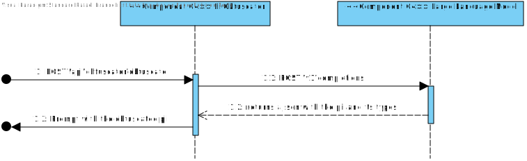
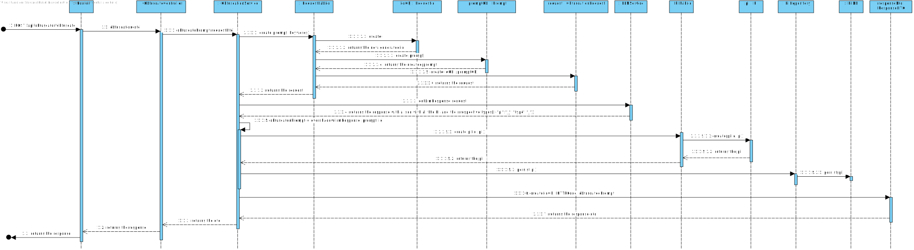

# US001

## Overshadow a *prompt*

## 1. Requirements

### 1.1. Client Acceptance Criteria
1. The format of each pii obfuscation must be of the type {typeOfPii_numberOnPrompt_reqId}
2. Each obfuscation must be within the context of the prompt.\
**Example**: My name is Rafael. \
**Response**: My name is {name_1_id} 
3. It must accept a various type of prompts. The prompt can be a document or text.
4. The PII must not be recognizable on the response
### 1.2 Specifications

### 1.3 Dependencies

This functionality has no dependency with any other

## 2. Analysis

For this functionality, it is necessary to carry out an extensive analysis of the tools to be used and the possible errors
from them. To obfuscate a *prompt*, i.e. hide personal data from it, you can use for example
a NER or a trained LLM. In this case, for the time being, an LLM is being used to detect personal data, or PII. 
Not all the same personal data should be hidden, so the initial *prompt* should take into account
a list of which personal data will be omitted. Therefore, the functionality will use an LLM that will receive a
*prompt* with PII that will be omitted based on a list that is sent in the request. The request also takes
into account the temperature for the request to the LLM, i.e. how predictable the next *tokens* to be read will be.

## 3. Design

### 3.1.1 Nível 2 Process View


### 3.1.2 Nível 3 Process View

### 3.2. Nível 3 Implementation View

### 3.3. Data Structure

#### 3.3.1 Pedidos

```JSON
{
  "prompt": "Example prompt: my email is: email@email.com",
  "keywords": ["email"]
}
```

#### 3.3.2 Responses
```JSON
{
  "id": "GGUI",
  "code": 200,
  "prompt": "Example prompt: my email is: {email_GGUI}"
}
```
### 3.4. Tests
| Use Case                                      | Class Under Test      | Test                                                           | Expected Result                                              |
|:----------------------------------------------|:----------------------|:---------------------------------------------------------------|:-------------------------------------------------------------|
| Obfuscate a valid prompt                      | ObfuscationController | validObfuscation()                                             | "My name is {name_1_"+reqId+"}"                              |
|                                               | ObfuscationService    | service.overshadow                                             | "My name is {Name_1_"+reqId+"}. Im {Age_1_"+reqId+"} years." |
| Obfuscate an empty prompt                     | ObfuscationController | ctrl.obfuscation(dto)                                          | ResponseDTO(UUID.randomUUID().toString(), 200, "")           | 
| Obfuscate a null prompt                       | ObfuscationService    | service.overshadow(null, null, reqIdTemplate)                  | "argument \"content\" is null"                               |
 | Obfuscate with invalid json from LLM response | ObfuscationService    | service.overshadow(invalidJson, promptTemplate, reqIdTemplate) | Throw an OvershadowingJsonParseException                       |
 | Obfuscate with no PII in the sentence | ObfuscationService    | service.overshadow(llmResponseTemplate, prompt, reqIdTemplate) | The result is equals to the request | 
| Obfuscate with repeated pii | ObfuscationService | service.overshadow(llmResponse, promptWithRepeatedPii, reqIdTemplate) | "My name is {Name_1_"+reqIdTemplate+"}. Im {Age_1_"+reqIdTemplate+"} years. " +"I work with {Name_2_"+reqIdTemplate+"}. Me, {Name_1_"+reqIdTemplate+"} " +"have no problem in working with {Name_2_"+reqIdTemplate+"}" |


## 4. Implementation
The classes involved on this US are:

* [ObfuscationController](../../../src/main/java/prompt/overshadowing/controllers/ObfuscationController.java)
* [ObfuscationService](../../../src/main/java/prompt/overshadowing/services/OvershadowingService.java)

## 5. Integration

## 6. Observations